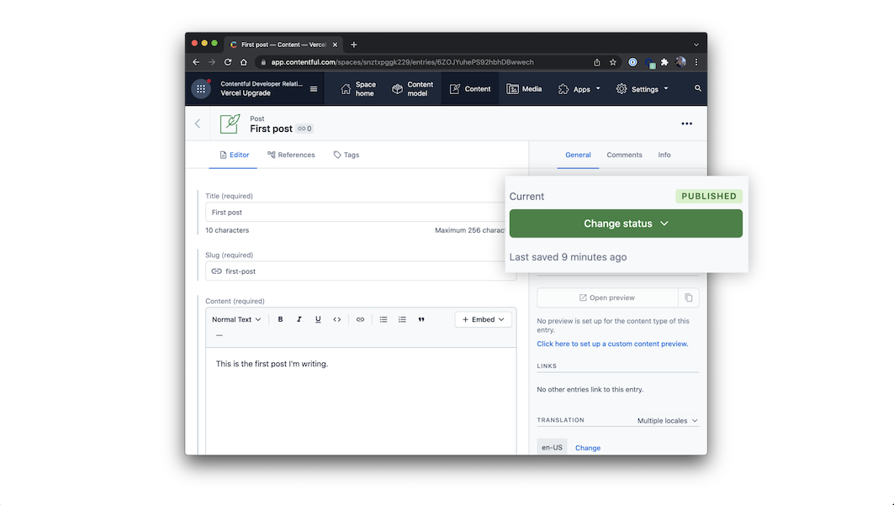

# CMS AS CODE PROC

A demo project with nextjs and contentful

## Installation

Install packages
```bash
  git clone https://github.com/glenn-osc/cms-as-code-poc.git
  cd cms-as-code-poc
  cp .env.local.example .env.local
  npm i
  npm dev
```

## If you have a contentful account and want to setup from scratch:

Run a script to create the content model: 
```bash
  npx cross-env CONTENTFUL_SPACE_ID=YOUR_SPACE_ID CONTENTFUL_MANAGEMENT_TOKEN=XXX npm run setup
```


This command will create the needed content structures and set up your Contentful space ready to use. The output should look as follows:

```
> cms-contentful@1.0.0 setup /Users/stefan.judis/Projects/next.js/examples/cms-contentful
> node ./contentful/setup.js $CONTENTFUL_SPACE_ID $CONTENTFUL_MANAGEMENT_TOKEN

┌──────────────────────────────────────────────────┐
│ The following entities are going to be imported: │
├─────────────────────────────────┬────────────────┤
│ Content Types                   │ 2              │
├─────────────────────────────────┼────────────────┤
│ Editor Interfaces               │ 2              │
├─────────────────────────────────┼────────────────┤
│ Locales                         │ 1              │
├─────────────────────────────────┼────────────────┤
│ Webhooks                        │ 0              │
├─────────────────────────────────┼────────────────┤
│ Entries                         │ 0              │
├─────────────────────────────────┼────────────────┤
│ Assets                          │ 0              │
└─────────────────────────────────┴────────────────┘
 ✔ Validating content-file
 ✔ Initialize client (1s)
 ✔ Checking if destination space already has any content and retrieving it (2s)
 ✔ Apply transformations to source data (1s)
 ✔ Push content to destination space
   ✔ Connecting to space (1s)
   ...
   ...
   ...
```

After setting up the content model (either manually or by running `npm run setup` or `yarn setup`), it should look as follows.

**Content model overview**


Go to the **Content** section in your space, then click on **Add entry** and select the **Author** content type:

- You just need **1 author entry**.
- Use dummy data for the text.
- For the image, you can download one from [Unsplash](https://unsplash.com/).

Next, create another entry with the content type **Post**:

- We recommend creating at least **2 post entries**.
- Use dummy data for the text.
- For images, you can download them from [Unsplash](https://unsplash.com/).
- Pick the **author** you created earlier.

**Important:** For each entry and asset, you need to click on **Publish**. If not, the entry will be in draft state.



## Try preview mode

In your Contentful space, go to **Settings > Content preview** and add a new content preview for development.

The **Name** field may be anything, like `Development`. Then, under **Content preview URLs**, check **Post** and set its value to:

```
http://localhost:3000/api/preview?secret=<CONTENTFUL_PREVIEW_SECRET>&slug={entry.fields.slug}
```

Replace `<CONTENTFUL_PREVIEW_SECRET>` with its respective value in `.env.local`.


Once saved, go to one of the posts you've created and:

- **Update the title**. For example, you can add `[Draft]` in front of the title.
- The state of the post will switch to **CHANGED** automatically. **Do not** publish it. By doing this, the post will be in draft state.
- In the sidebar, you will see the **Open preview** button. Click on it!


You will now be able to see the updated title. To exit preview mode, you can click on **Click here to exit preview mode** at the top of the page.


